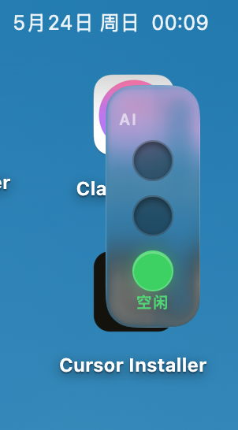

# AI Traffic Light

[中文文档](README.zh-CN.md)

A macOS menu-bar app with a floating traffic-light widget that shows real-time AI agent activity across **Cursor**, **Claude Code**, and **OpenAI Codex**.

- 🟢 **Idle** — no active agent work
- 🟡 **Thinking** — prompt submitted or reasoning in progress
- 🔴 **Running** — tool call in progress



## Quick start (end users)

### Install from GitHub Releases (recommended)

1. Download **`AITrafficLight-x.y.z-macOS-universal.dmg`** from [Releases](https://github.com/vangeldu/ai_traffic_light/releases)
2. Open the DMG, drag **AI Traffic Light** into **Applications**
3. **First launch only** (unsigned build) — use either method:
   - **Right-click** the app → **Open** → **Open** again, or
   - Double-click once (it may be blocked), then open **System Settings → Privacy & Security**, scroll down, and click **Open Anyway** / **仍要打开**
4. Fully quit and reopen **Cursor**, **Claude Code**, and/or **Codex** once
5. Use your tools as usual — the lamp follows agent activity

The release build is a **universal binary** (Apple Silicon + Intel). Requires **macOS 13+**.

A `.zip` of the app is also attached to each release if you prefer that over the DMG.

### Build from source

```bash
# Build .app for local development (host architecture only)
./scripts/build.sh
open dist/AITrafficLight.app

# Build release artifacts for GitHub (universal + DMG + ZIP)
./scripts/release.sh 1.0.0
```

**No install scripts are required.** On first launch, the app automatically:

1. Installs the hook CLI to `~/.local/share/ai-traffic-light/bin/`
2. Registers hooks for Cursor, Claude Code, and Codex
3. Enables Codex hooks (`[features].hooks = true`) and auto-trusts them

Use the menu-bar item **Reinstall IDE Integration** if hooks need to be refreshed after an app update.

## For developers

```bash
# Build .app (host architecture, fast local iteration)
./scripts/build.sh

# Build .app (Apple Silicon + Intel)
./scripts/build.sh --universal

# Release: universal .app + DMG + ZIP + checksums
./scripts/release.sh 1.0.0

# Run locally (uses repo ui/widget.html)
./scripts/run.sh

# Optional: install hooks without launching the app
./scripts/install-all-hooks.sh

# Publish a GitHub Release (after pushing tag v1.0.0)
git tag v1.0.0
git push origin v1.0.0
```

Requirements: macOS 13+, Xcode Command Line Tools (Swift). Python 3 is used by bundled helper scripts (Codex trust, dev install); macOS includes it by default.

## How it works

```text
Cursor / Claude Code / Codex hooks
    -->  ~/.local/share/ai-traffic-light/bin/ai-traffic-light-hook
    -->  ~/Library/Application Support/ai-traffic-light/state.json
                                              |
Floating macOS app (Swift + WKWebView)  <---- watches state file
         |
    ui/widget.html
```

### Multi-source merge

Each IDE writes its own state (`cursor`, `claude`, `codex`). The effective lamp state is merged with priority:

`running` > `thinking` > `idle`

When priorities tie, the most recently updated source wins.

If a source stops sending events (for example a missing `stop` hook), stale states recover automatically: **60s** for `running`, **90s** for `thinking`.

### Cursor + Claude Code in Cursor

Cursor also loads hooks from `~/.claude/settings.json`. The hook CLI detects Cursor invocations (via `cursor_version` in hook stdin) and **skips** writing the `claude` / `codex` sources in that context, so Cursor activity is tracked only under the `cursor` source.

When a Cursor turn ends, `afterAgentResponse` / `stop` / `sessionEnd` call `set idle all` to clear every source at once.

### Hook mapping

| Tool | Event | State |
|------|-------|-------|
| Cursor | `beforeSubmitPrompt` | thinking |
| Cursor | `preToolUse` | running |
| Cursor | `postToolUse` | thinking |
| Cursor | `afterAgentResponse` / `stop` / `sessionEnd` | idle (all sources) |
| Claude Code | `UserPromptSubmit` | thinking |
| Claude Code | `PreToolUse` | running |
| Claude Code | `PostToolUse` | thinking |
| Claude Code | `PostToolUseFailure` / `Stop` / `SessionEnd` | idle |
| Codex | `UserPromptSubmit` | thinking |
| Codex | `PreToolUse` | running |
| Codex | `PostToolUse` | thinking |
| Codex | `Stop` | idle |

Config files touched:

| Tool | Path |
|------|------|
| Cursor | `~/.cursor/hooks.json` |
| Claude Code | `~/.claude/settings.json` |
| Codex | `~/.codex/hooks.json`, `~/.codex/config.toml` |

## Project layout

```text
ai_traffic_light/
├── ui/widget.html                  # Floating widget UI
├── preview/                        # Browser previews
├── hooks/                          # Hook templates + helpers (bundled into the app)
│   ├── *-hooks.fragment.json
│   ├── merge-hooks-config.py
│   └── trust-codex-hooks.py
├── scripts/
│   ├── build.sh
│   ├── run.sh
│   └── install-all-hooks.sh        # Dev-only hook installer
└── app/
    ├── Sources/AITrafficLight/         # App + auto-installer
    ├── Sources/AITrafficLightHook/     # Hook CLI shipped with the app
    └── Sources/TrafficLightCore/       # Shared state writer
```

## Manual testing

```bash
HOOK=~/.local/share/ai-traffic-light/bin/ai-traffic-light-hook

$HOOK set running claude
$HOOK set thinking codex
$HOOK set idle all          # reset every source
```

## Notes

- **Restart IDEs** after the first install or after **Reinstall IDE Integration**.
- **First open (unsigned)**: macOS may block the app on the first launch. Either **right-click → Open**, or after a blocked double-click go to **System Settings → Privacy & Security** and choose **Open Anyway**. A signed/notarized build would skip this (see Roadmap).
- **Codex**: hooks are enabled and trusted automatically; if the lamp does not react, quit Codex completely (Cmd+Q) and reopen it.
- Claude Code and Codex hooks are **appended** to your existing hook config (other hooks are kept).
- Cursor hook entries managed by this app are **replaced** on reinstall; removed events (for example old `afterAgentThought` entries) are cleaned up.

## Roadmap

- Login item / launch at startup
- Apple Developer ID signing and notarization

## License

MIT (add a LICENSE file if you plan to open-source formally)
